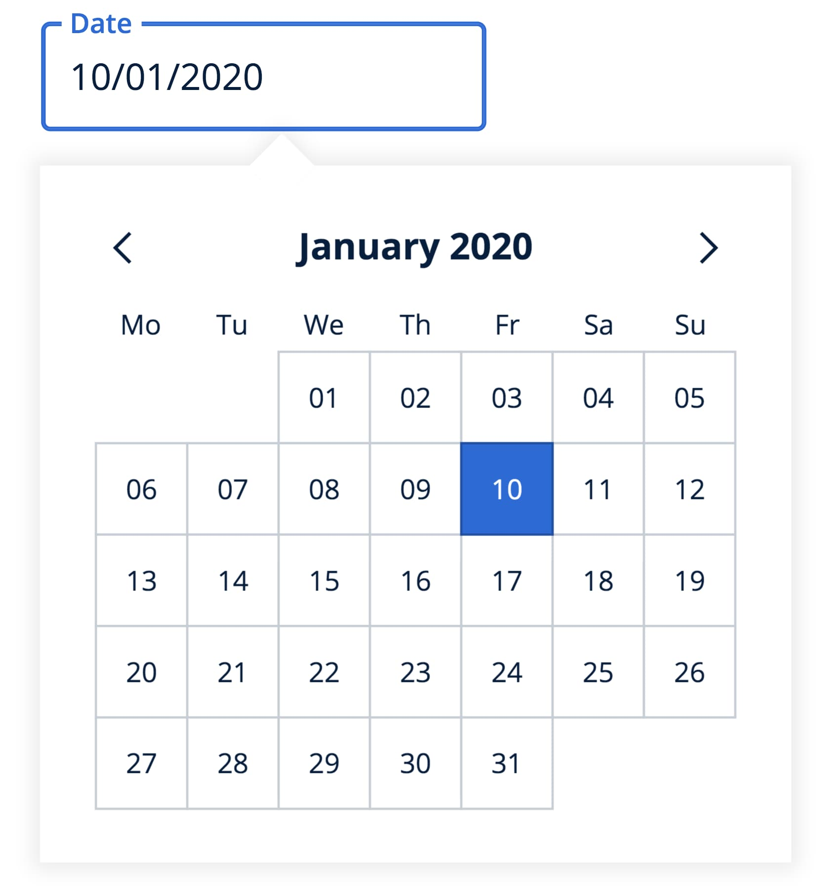
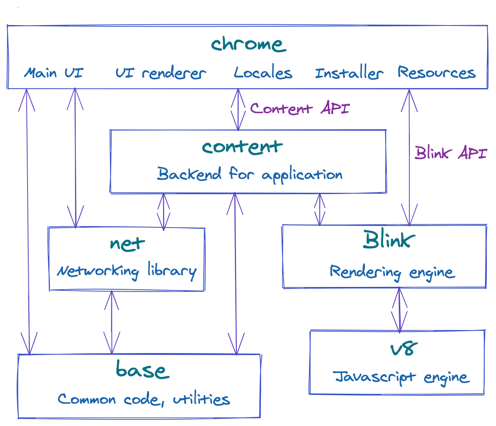
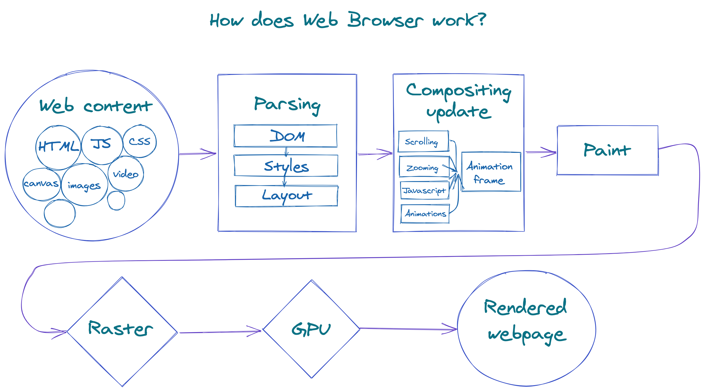
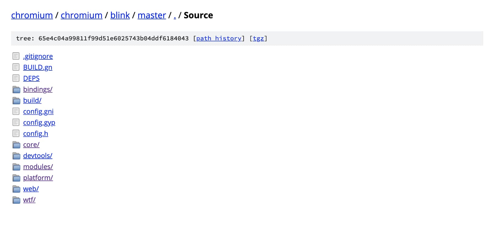

Let me tell you a story. Once I was building yet another date picker component for our design system. It consists of text input and pop-up with a calendar that shows by clicking on it. Then pop-up can be closed on click outside or if the date was selected.

<div class="image-left">
    
</div>

Most implementations of the click outside logic made with actual click listeners attached to the DOM. However, I wanted to build our date picker accessible, so you could open a calendar with tabs and close the same way. Additionally, click listeners may conflict with each other if you put several date pickers on the page.

What if you could just rely on native focus and blur events instead of detecting clicks outside? They naturally support tabs, touch and click events, and already implemented in the browser. The only problem you need to solve in this case is when you click on the pop-up but without date selection: focus shifts to the calendar, triggering blur event on the text input and eventually closing the pop-up.

At this point, I started wondering if there is a way to click but do not shift a focus. After quick googling, I found a way to do it: prevent the default action of the `mouseDown` event for the pop-up. Just like that in one line, all clicks worked but the focus was still on the text input.

It seemed like that's the solution, let's move forward, but something inside of me was stopping me from that. Why specifically `mouseDown` and not `mouseUp` prevents focus but propagates click? Is it some part of the living standards? Can we rely on that? Does it work cross-browser? React Testing Library that we used to do integration tests also didn't support it and I'd have to change simulation function.

## What is Web Standard?

Alright, since the Stack Overflow answer wasn't enough for me, so what could be a better place to learn about browser behavior than the web standards?

You probably heard about [W3C](https://www.w3.org/) or World Wide Web Consortium. It's an international community that develops open standards for the Web. W3C makes sure that everyone follows the same guidelines and we don't have to support dozens completely different environments. If you visit their website, you'll find the list of [all standards](https://www.w3.org/TR/) they're working on.

Let's have a look at the one document that might have an answer to our questions -  [UI Events Standard](https://www.w3.org/TR/2019/WD-uievents-20190530/). This document specifies the DOM event flow, defines a list of events and their execution order. If you thought that standards are boring, obscure, and hard-to-understand text blocks, then jump straight to [DOM Event Architecture](https://www.w3.org/TR/2019/WD-uievents-20190530/#dom-event-architecture) section that explains event bubbling and capturing with nice pictures and still being very specific as standard supposed to be. You'd be surprised by the quality of it, it's really well-written with a lot of examples and recommendations.

It also has a definition of our `mouseDown` event and its default actions:

> "Many implementations use the mousedown event to begin a variety of contextually dependent default actions. These default actions can be prevented if this event is canceled. Some of these default actions could include: beginning a drag/drop interaction with an image or link, starting text selection, etc. Additionally, some implementations provide a mouse-driven panning feature that is activated when the middle mouse button is pressed at the time the mousedown event is dispatched."

Alright, so our event has some default actions, but there is nothing specific about focus because it really depends on browser implementations. Let's check them out.

## Introduction to browser engines

A modern browser is a quite complicated piece of software with the codebase around [tens of millions of lines of code](https://www.openhub.net/p/chrome/analyses/latest/languages_summary). So it's usually split into several parts.

To find a place where focus events are defined, we need to get an overview of what each part is responsible for. Let's start with Chromium and its design documentation [Getting Around The Chrome Source Code](https://www.chromium.org/developers/how-tos/getting-around-the-chrome-source-code). As you can see there is a lot of modules responsible for different logic.



Let's briefly go over them to get the idea of how it works together.

- **chrome**: it's a base app with startup logic, UI, and all windows. It contains the projects for `chrome.exe` and `chrome.dll`. Resources such as icons or cursors you can also find here.

- **content**: it's a backend of the app which handles communication with child processes.

- **net**: this is the networking library that helps to make queries to websites.

- **base**: a place for common code shared between all sub-projects. This could include things like string manipulation, generic utilities, etc.

- **blink**: it's a rendering engine that responsible for the whole rendering pipeline including DOM trees, styles, events, V8 integration.

- **v8**: a final big part of a browser - Javascript engine. Its job is to compile JavaScript to native machine code.

As you can see browser consist of several independent parts that talk to each other via API. The most interesting parts for developers are usually Blink and V8. Browser defined default actions are not part of V8, but Blink should have all of them defined and implemented. But before we jump into the Blink codebase, let's understand how web browsers work from a user point of view.

## Rendering pipeline

Imagine you enter domain address in a browser, then it fetches and loads a bunch of assets: HTML, CSS, and JS files, images, icons. But what would happen next?



As a first step, HTML files would be parsed and turned into a **DOM tree**. The DOM is not only the internal representation of the page but also an API exposed to Javascript for querying or modifying the rendering through a system called "bindings".

After the DOM tree, the next step is to process the CSS styles. For that purpose browsers have a CSS parser that builds a model of the style rules. Having built a model for style rules, we can merge them together with a set of default styles supplied by the browser and compute the final value of every style property for every DOM element. This process is called **style resolving (or recalc)**.

In the next **layout** part, we need to determine the visual geometry of all the elements. At this stage each element gets its coordinates (x and y), width, and height. The layout engine calculates and keeps records of all overflow areas - which part is visible and which is not.

As we got all coordinates for all elements, it's time for **painting**. For this operation, we use coordinates from the previous step and color from style rules and combine them into a list of painting instructions. It's important to paint elements in the right order so that they stack correctly when they overlap. You can modify order via `z-index` style rule.

Let's execute our list of painting instructions and convert them into a bitmap of color values. This stage is called **raster**. At this moment we also take our images and decode them into bitmap as well.

Later the rastered bitmap will be stored in **GPU** memory. This stage includes libraries that abstract the hardware and issuing calls to OpenGL and DirectX on Windows. When GPU receives the instructions to display bitmap, it draws pixels on your screen.

Now we have the most important parts of the rendering pipeline. But what would happen if you scroll the page, or some animation would be applied? In fact, rendering is not static. Change is represented via **animation frames**. Each frame is a complete rendering of the state of the content at a particular point in time. The real challenge in this process is its performance. Smooth animations require generation at least 60 frames per second. It would almost impossible to complete a full pipeline 60 times in a second especially on slow devices.

What if instead of always re-rendering everything, we provide a way to **invalidate** an element at a specific stage. E.g. if you change the color of the button dynamically, the browser will mark this node as invalidated and it would be re-rerendered on the next animation frame. If nothing is changed we can reuse the old frame.

That's a good way to optimize small dynamic changes in the content. Let's think about change in big regions of content. For example, if scroll the page, all pixels have to be different now. For that purpose a page is decomposed into layers that raster independently. A layer can be fairly small and represent only one DOM node. Those layers then will be combined together on another thread called **the compositor thread**. With this optimization you don't need to re-raster everything, but rather do it for small layers and then correctly combine them together.

Now we have a little overview of what Blink does and how rendering pipeline looks like. Let's dive into the code.

## Navigating Blink codebase

It seems like we are finally at the finish line. Let's open the [Blink repository](https://chromium.googlesource.com/chromium/blink/+/master/Source) and look around.



We can quickly realize that even though we narrowed down a lot from our original question, it's still too big to manually find a specific line of code responsible for preventing focus.

Let's try to search by our event name in Google:

```bash
mousedown site:https://chromium.googlesource.com/chromium/blink/+/master/Source
```

It leads us to the [EventHandler](https://chromium.googlesource.com/chromium/blink/+/master/Source/core/input/EventHandler.cpp#972) file where you can find implementation details for a lot of input events. Including the most important line for us:

```c++
bool swallowEvent = !dispatchMouseEvent(EventTypeNames::mousedown, mev.innerNode(), m_clickCount, mouseEvent);
```

`dispatchMouseEvent` return value means "continue default handling", so `swallowEvent` is `true` in case of `preventDefault` usage.

Just below there is a call for focus event which is triggered only if `swallowEvent == false`.

```c++
swallowEvent = swallowEvent || handleMouseFocus(MouseEventWithHitTestResults(mouseEvent, hitTestResult), sourceCapabilities);
```

Apart from focus handling, you can explore all default actions of the mouse down event including selection, drag-drop, and scrollbar cases. It also implements mouse release and double clicks events - everything is there.

## Gecko and WebKit

At this point, we already spent some time discovering browsers source code and have a pretty good understanding of their structure, so why not check Firefox and Safari altogether. Firefox's browser engine called Gecko and Safari's - WebKit.

Gecko also has an [overview page](https://wiki.mozilla.org/Gecko:Overview) for developers, so you'd get an idea of the main concepts of it. Based on the experience with Chrome, you can find a neat 6000 lines of code [EventStateManager](https://github.com/mozilla/gecko-dev/blob/master/dom/events/EventStateManager.cpp#L3177) file with events default actions and behavior. I've included a specific line in the link, so you won't have to go through it all.

[WebKit](https://webkit.org/) is a browser engine from Apple used in Safari and other Apple products. Chrome's Blink was forked from WebKit, so they have a lot of things in common and it wasn't a problem to find events implementation in their version of [EventHandler](https://github.com/WebKit/webkit/blob/1321fa346ad792f6de3ace65ca98cbe3957a96c6/Source/WebCore/page/EventHandler.cpp#L1757) file.

Now since we made sure we can prevent `mousedown` event safely, I can step back and finish the PR with the date picker.

## Conclusion

Together we went a journey from a simple problem to the introduction of Web Standards and browser implementation details.

Don't be scared by the hidden complexity of existing modules even if it's a browser or compiler. It will be a fun journey in the end. The chances are you can easily find things to improve, and more importantly, get unique insights into how things actually work. I've learned a ton of stuff during this deep dive and encourage everyone to do the same. Browsers will provide excellent documentation along the way at the point that I'm not sure why I need anything else.

## Relevant links for further reading

- Do you know what DOM is? How it's represented internally? What's the purpose of events? I'd highly recommend [DOM Standard](https://dom.spec.whatwg.org/) to everyone from beginners to more experienced developers. ["An event signifies an occurrence, not an action."](https://dom.spec.whatwg.org/#action-versus-occurance) - my favorite part of it.

- Official website of the [W3C](https://www.w3.org/) community.

- [Getting around Chromium codebase](https://www.chromium.org/developers/how-tos/getting-around-the-chrome-source-code).

- [Design documents](https://www.chromium.org/developers/design-documents) published by Chromium developers.

- [Life of a pixel](https://docs.google.com/presentation/d/1boPxbgNrTU0ddsc144rcXayGA_WF53k96imRH8Mp34Y/edit) - introduction into rendering pipeline of Chrome.
